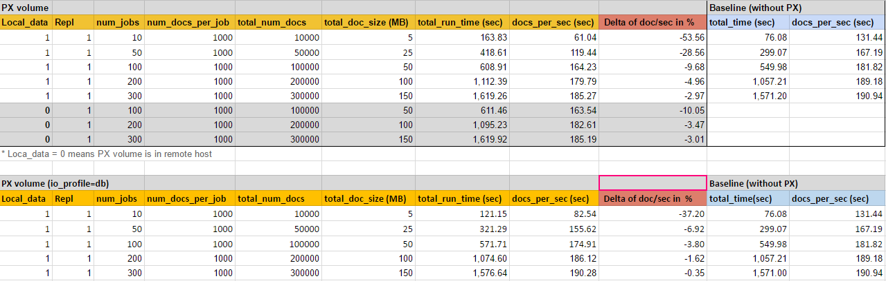

# couchdb-px-testing

### Testing Couchdb 2.0 performance on PX volume 

The following is the testing result of Couchdb 2.0 Docker container running on a single PX volume (50GB in size and no repl). 
The test is conducted by  running simultaneous jobs to insert documents into the target couchdb database. Each job consists of inserting 1000 documents  and each document size is about 500 bytes message. The total payload of each job is about 5MB.

We run the Couchdb test on PX  in the following cases:

 - Generic Local PX volume in 50GB size and PX repl=1; tests includes 100, 200 and 300 number of jobs.
 - Generic Remote PX volume in 50GB size and PX repl=1; tests includes 100, 200 and 300 number of jobs.
 - Local PX volume with io_profile=db; 50GB in size and PX repl=1; test includes 10,50 and 100 number of jobs
 

The result shows that in large number of jobs or document inserting at the same time; the difference in % between baseline and PX volume is smaller. And using PX volume with  io_profile=db also improves the performance in large number of jobs.

The test also compare with baseline system that is the same Couchdb 2.0 Docker container running on local disk volume (50GB in size) formatted as EXT4.

